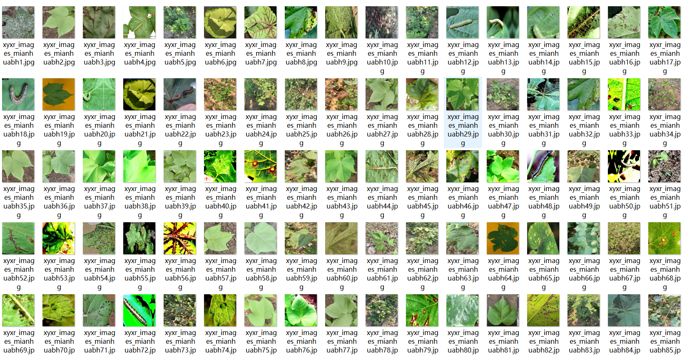
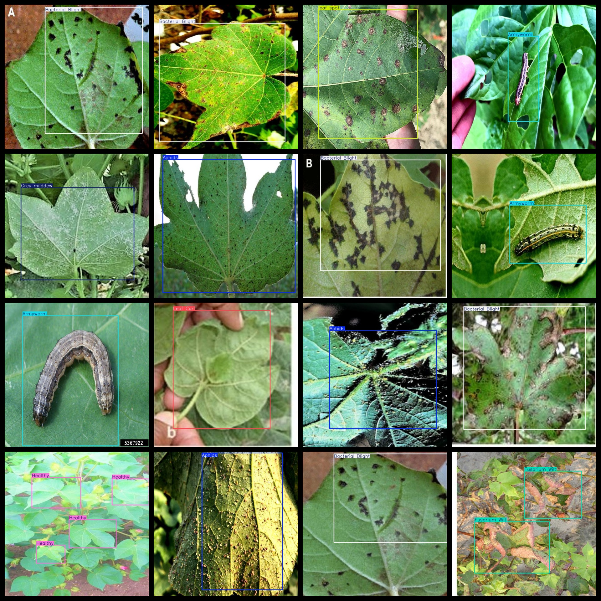

# The Cotton Disease Dataset is a large-scale multi-label image dataset for the task of cotton diseases detection. It includes 2303 images in the YOLO+VOC format, where VOC stands for Visual Object Classes. The dataset is available for download from the official website: https://github.com/cuihao1986/cotton_disease_dataset.

The dataset format includes both VOC and YOLO formats.

The zip file contains three folders, each storing images, xml files, and txt files.

The JPEGImages folder contains a total of 2303 jpg images.

The Annotations folder contains a total of 2303 xml files.

The labels folder contains a total of 2303 txt files.

There are a total of 8 label types: ["Aphids", "Armyworm", "Bacterial Blight", "Fusarium Wilt", "Grey milddew", "Healthy", "Leaf Curl", "leaf spot"]

The label names are: ["Aphids", "Mites", "White Blight", "Blight", "Botrytis", "Healthy", "Rolling Leaves Disease", "Leaf Blight"]

The number of boxes per label type (note that the order in the yolo format does not correspond to this, but rather it is based on the classes.txt in the labels folder):

- Aphids: 330 boxes

- Armyworm: 357 boxes

- Bacterial Blight: 510 boxes

- Fusarium Wilt: 475 boxes

- Grey mildew: 105 boxes

- Healthy: 1665 boxes

- Leaf Curl: 176 boxes

- leaf spot: 757 boxes

Total box count: 4375

The image resolution is clear.

The images have not been enhanced.

The shape of the labels is rectangular boxes, used for target detection identification.

Special Note: The dataset does not guarantee the accuracy or precision of the trained models or weight files. The dataset only provides accurate and reasonable annotations.

Annotation and Image Details as follows:
## Images

---

Here is a pay link on Stripe (https://buy.stripe.com/3cs8yP7sY87d0vu9AB). Please contact me lonlonago@foxmail.com after funding $89, and I will send you a complete data files, thank you!

